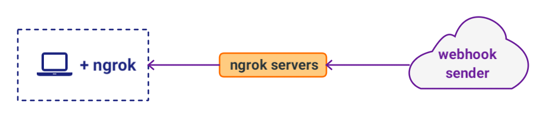

.. footer::

    #VonageCampus ~ @lornajane

Getting Started with Voice API
##############################

.. class:: titleslideinfo

    Lorna Mitchell

.. Change to a standard page
.. raw:: pdf

    PageBreak standardPage

Getting Started with Voice API
==============================

Use the Voice API to make and receive calls, play audio, send and
receive DTMF tones, and to record calls.

|

Workshop plan:

* Introduce concepts and vocabulary (mostly talking)
* Make and receive calls (hands-on)
* Interact with user input (hands-on)

.. raw:: pdf

    TextAnnotation "A bit of talking, then three exercises for you to try. Use the time well, we're here to help and we'd love to show you around!"

    TextAnnotation "First up: the abbreviation you're going to hear the most today!"

.. Change to a title page
.. raw:: pdf

    PageBreak stepsPage

NCCO: Nexmo Call Control Object
===============================

.. Change to a standard page
.. raw:: pdf

    PageBreak standardPage

NCCO: Nexmo Call Control Object
===============================

A series of steps: e.g. text-to-speech

.. code:: json

  [
    {
      "action": "talk",
      "text": "You are listening to a call made with Nexmo Voice API"
    }
  ]

|

|

You can find a full reference here: https://developer.nexmo.com/voice/voice-api/ncco-reference

.. raw:: pdf

    TextAnnotation "NCCOs describe the flow of the call. They are a series of steps described in JSON"

    TextAnnotation "NCCOs can contain multiple objects in the array, they are done in order and then the call ends when there are no more"

    TextAnnotation "**DEMO:** Open the NCCO reference page from developer.nexmo.com to encourage people"

    TextAnnotation "(list of examples on next slide, don't list here)"

NCCO: Nexmo Call Control Object
===============================

Elements in an NCCO may include:

- text-to-speech
- playing audio (optionally looping)
- recording a call
- accepting DTMF input
- transferring a call (to a conference, or a new NCCO)
- ... and much more

.. raw:: pdf

  TextAnnotation "Emphasise that these are really important at every stage of voice call applications!"

  TextAnnotation "Recordings: start with NCCO, webhook on completion with download link. This is in one of today's stretch goals"

  TextAnnotation "Audio should be hosted on a public URL, such as S3"

  TextAnnotation "DTMF you ask for input, and give the URL to send a webhook to with digits in. That URL (synchronously) returns a new NCCO in response to the given data."

  TextAnnotation "Call vs Conferences is the next slide"

Calls vs Conferences
====================

There are two types of conversation that you might use:

- A "call" is a temporary conversation that only exists for as long as the call is taking place

- A "conference" is a conversation with a name, that additional callers can be added to. This type of conversation persists and can be reused.

|

.. code:: json

    {
      "action": "conversation",
      "name": "nexmo-conference-standard",
      "record": "true"
    }

.. raw:: pdf

  TextAnnotation "Today's examples only use calls"

  TextAnnotation "Use a Conference when you need to know which conversation to have new users join, e.g. conference call or an outgoing call to connect to an existing call when it is answered"

.. Change to a title page
.. raw:: pdf

    PageBreak signpostPage

Nexmo Voice API
===============

.. Change to a standard page
.. raw:: pdf

    PageBreak standardPage

Nexmo Voice API
===============

Make an API call to:

* make an outgoing call (our first hands-on exercise today)
* hang up a call
* transfer a call
* interact with an in-progress call
* get information about current and past calls

.. raw:: pdf

  TextAnnotation "Make the distinction between the NCCO (supplied when the call is started/answered) and the API which operates on the in-progress call and can change things even during the course of an NCCO."

How to Use Voice API
====================

The Voice API is an HTTP API

* Explore the API with Postman or your favorite HTTP client
* Use ``request(s)`` or whichever library you prefer in your application
* Try one of our Server SDKS: https://developer.nexmo.com/tools (recommended)

|

You will find lots of code examples and the API reference on https://developer.nexmo.com

.. raw:: pdf

  TextAnnotation "Really recommend our server SDKs, they make things easier. Available for Java, .NET, Python, NodeJS, PHP, Ruby and Golang."

  TextAnnotation "Code samples on Nexmo Developer have cURL as well so if you're not using a lib, check those"

  TextAnnotation "For exploring the APIs, grab the OpenAPI spec and import into Postman. **DEMO** but no API calls (you need a JWT). Video of this also available"

.. Change to a title page
.. raw:: pdf

    PageBreak comboPage

NCCO + API = Many Good Things
=============================

.. raw:: pdf

    TextAnnotation "Combining the NCCOs to control program flow and the API calls to react to events allows us to create interesting and fully-featured applications."
  TextAnnotation "Some things can be done with either technique, but some things need one or the other! Expect to need both."

.. Change to a standard page
.. raw:: pdf

    PageBreak standardPage

Voice API Examples
==================

*  IVR

  -  Incoming call, serve NCCO to answer it
  -  Prompt user for DTMF input
  -  DTMF input arrives as a webhook, return a new NCCO

*  Proxy

  -  Incoming call, serve NCCO to answer it
  -  Put user into conference
  -  API call to place outgoing call to other user, with NCCO to join same conference

.. raw:: pdf

  TextAnnotation "IVR = Interactive Voice Response"

  TextAnnotation "Use the proxy to allow customers to connect with staff (for example) without revealing actual numbers"

  TextAnnotation "Next: more detail on webhooks"

Voice Webhooks
==============

Data to your application from Nexmo

|

* Webhooks are events sent via HTTP request to an endpoint in your application
  
* Your application needs to be able to receive requests and respond

.. raw:: pdf

  TextAnnotation "(This is almost a title slide, third and final part of the puzzle)"

  TextAnnotation "Webhooks are the link we've missed so far. Things happen, we let your app know"

  TextAnnotation "Updates on status, and payloads in response to events"

  TextAnnotation "Must ack the webhook, in a specific timeframe. Nexmo will retry if not"

  TextAnnotation "Set your URLs through the dashboard or via CLI when you create your application configuration and register a phone number to it"

Voice Webhooks
==============

Webhooks can be expected:

-  When the call is answered, an HTTP request to the ``answer_url``
-  When events such as "ringing", "answered", "completed" occur, HTTP requests to the ``event_url``
-  Keypad digits from an ``input`` action are sent to the specified URL
-  When a recording is completed, an HTTP request to the ``recording_url``
-  When a ``notify`` action in an NCCO is processed

.. raw:: pdf

  TextAnnotation "Answer webhook when someone calls your Nexmo number. Nexmo servers hit your URL and you return an NCCO."

  TextAnnotation "Events show up at the ``event_url``. This is great for knowing what is going on - errors go there too!"

  TextAnnotation "DTMF input results in a webhook with a ``dtmf`` field, you return an NCCO"

  TextAnnotation "When recording is ready, webhook to ``recording_url`` has a link to the file to download"

  TextAnnotation "``notify`` is an NCCO action that sends a webhook to a URL. The NCCO continues afterwards, useful for progress indicators - or you can return an NCCO"

The Answer Webhook
==================

When someone calls your Nexmo number, you get a webhook like this:

.. code:: json

  {
    "from": "442079460000",
    "to": "447700900000",
    "uuid": "aaaaaaaa-bbbb-cccc-dddd-0123456789ab",
    "conversation_uuid": "CON-aaaaaaaa-bbbb-cccc-dddd-0123456789ab"
  }

|

Your code must return a valid NCCO

.. raw:: pdf

  TextAnnotation "Compare with when we do an outgoing call, we can either specify an ``answer_url`` and serve an NCCO, or provide the NCCO when making the call"

The Event Webhook
=================

Many different events can produce webhooks to the ``event_url``:

* Changes in call state e.g. "ringing"/"answered"
* ``record`` and ``input`` actions can specify a URL, which may be the same as the event URL
* Errors will also be sent to the ``event_url``

|

Detailed reference: https://developer.nexmo.com/voice/voice-api/webhook-reference#event-webhook

.. raw:: pdf

  TextAnnotation "Make sure in your own applications that you are capturing this stuff somewhere. Interesting for success, but vital for debugging"

  TextAnnotation "There are some tricks to working with webhooks locally: I'd like to share some tips"

Webhooks on Dev Platforms
=========================

https://ngrok.com/ - secure tunnel to your dev platform

|

Use this tool to:

- webhook into code running locally
- inspect the request and response of the webhook
- replay requests and see the responses

.. raw:: pdf

  TextAnnotation "Proprietary tool with a free tier"

  TextAnnotation "Get a paid account to get a static URL so you don't have to update your webhook configs so often!"

  TextAnnotation "You could also push to cloud"

Ngrok for Testing Webhooks
==========================

Start the tunnel on your laptop: receive a public URL

|

|

We have a blog post about this: https://www.nexmo.com/blog/2017/07/04/local-development-nexmo-ngrok-tunnel-dr

.. raw:: pdf
  TextAnnotation "Google Nexmo and Ngrok to find the post, or see the resources section in the GitHub Repo"

  TextAnnotation "This makes quite a neat demo for anyone who hasn't seen it before. Start a local webserver with basic test script, make some curl requests to it, then show the console interface and web dashboard and replay button."

  TextAnnotation "Encourage people to download/install while I'm talking ..."

Voice Events Logger
===================

A tool you can use to direct your ``event_url`` to, it just acknowledges the webhook and displays what arrived.

|

https://github.com/Nexmo/voice-event-logger - it can be run locally or deployed to Heroku

.. raw:: pdf

  TextAnnotation "A very basic debugging tool to get you started. In a real application you would want to handle the events yourself."

Further Reading
===============

* Exercises at https://voice-workshop.nexmodev.com/
* Developer portal https://developer.nexmo.com
* Tutorials for Voice API https://developer.nexmo.com/voice/voice-api/use-cases/
* Our blog https://nexmo.com/blog
* Tell us what you think! ``@NexmoDev`` on twitter

.. raw:: pdf

  TextAnnotation "The exercises are the rest of the session. Please use the time! Ask us anything!"

  TextAnnotation "Any tech stack will do"

  TextAnnotation "Open the exercises, ask people to ask for help!"
